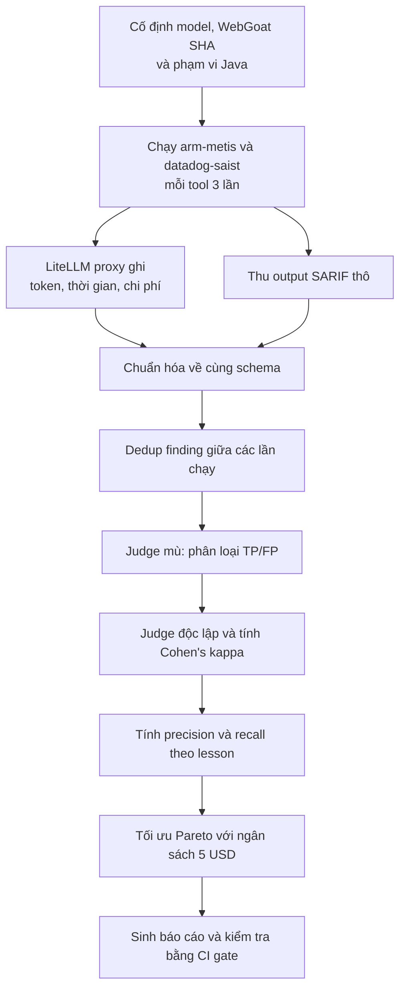

# Báo cáo Week 1 

Trong bài này, em thử so sánh hai công cụ quét mã nguồn là `arm-metis` và
`datadog-saist` trên cùng mã nguồn WebGoat. Hai tool được cho dùng cùng model
`gemini-3.1-flash-lite`, cùng phiên bản WebGoat và cùng phạm vi mã Java để kết
quả công bằng.

# Cơ chế hoạt động

Quét bảo mật bằng AI không phải là đưa source code cho AI rồi hỏi xem có lỗi bảo mật nào không
mà quy trình thực tế gồm nhiều bước như là:

- SAST là cách kiểm tra mã nguồn mà không cần chạy ứng dụng để tấn công nó. 
Cách thức là tool chọn file hoặc đoạn code cần đọc, tạo câu hỏi cho model, nhận câu trả lời rồi chuyển chúng thành các finding.
Vì vậy, dù hai tool dùng cùng một model, kết quả vẫn khác nhau do cách mỗi tool chia code, đặt câu hỏi và lọc kết quả khác nhau.

- Mỗi tool được chạy ba lần: lần đầu là cold run, hai lần sau là warm run. Trong đó cold run có thể tốn thêm thời gian để tạo cache hoặc chuẩn bị dữ liệu, còn warm run gần với những lần sử dụng tiếp theo hơn.

- Vì Muốn so chi phí giữa các tool, phải biết mỗi tool tốn bao nhiêu token và thời gian. 
Nhưng mỗi tool tự report token một kiểu, có tool giấu hẳn. Nên cần tạo một LiteLLM proxy - proxy này giống như một bộ đếm đặt ở giữa tool và model: nó ghi lại số lần gọi, token, thời gian và chi phí. Nhờ vậy, số liệu không chỉ dựa vào log riêng của từng tool.

- Sau khi quét, mỗi tool trả kết quả theo một dạng khác nhau. Project chuyển tất
cả về cùng một cấu trúc, sau đó gộp các finding bị trùng. Các finding xuất hiện
ở cả ba lần chạy được xem là ổn định.

- Cuối cùng, các finding được judge chấm là TP hoặc FP. 
Project còn dùng thêm một judge độc lập để kiểm tra xem kết luận có phụ thuộc quá nhiều vào một cách chấm hay không. Vì judge cũng là model nên kết quả chấm không được xem như đáp án
tuyệt đối; những finding quan trọng vẫn cần con người kiểm tra lại.

Nhận xét : tool báo nhiều nhất chưa chắc là tool tốt nhất. Nếu một tool
báo rất nhiều nhưng có nhiều báo động giả thì người dùng vẫn phải mất công đọc
và loại chúng. Vì vậy cần nhìn đồng thời số TP, precision, recall, thời gian và
chi phí.

Luồng hoạt động

## Kết quả scan ban đầu

Mỗi tool được chạy ba lần trên WebGoat. 
Bảng dưới dùng kết quả judge độc lập và recall strict ở mức lesson.

| Chỉ số | `arm-metis` | `datadog-saist` |
|---|---:|---:|
| Finding duy nhất sau dedup | 280 | 46 |
| Finding ổn định, xuất hiện 3/3 lần | 272 | 30 |
| Finding thuộc phạm vi được judge | 192 | 46 |
| True Positive (TP) | 148 | 41 |
| False Positive (FP) | 44 | 5 |
| Precision độc lập | 77,08% | 89,13% |
| Recall strict theo lesson | 14/22 (63,64%) | 5/22 (22,73%) |
| Thời gian trung vị baseline | 142 giây | 13 giây |
| Tổng token trung vị baseline | 4.585.821 | 681.769 |
| Chi phí trung vị baseline | 0,841598 USD | 0,182733 USD |

Qua bảng này, em thấy `arm-metis` tìm được nhiều TP và bao phủ nhiều lesson hơn,
nhưng chạy lâu và tốn nhiều token hơn. `datadog-saist` tìm được ít lỗ hổng hơn
nhưng có precision cao hơn, chạy nhanh hơn và rẻ hơn.

## Kiểm tra độ tin cậy của judge

Judge ban đầu và judge độc lập cùng chấm một tập gồm 238 finding:

| Chỉ số | Kết quả |
|---|---:|
| Số finding được đối chiếu | 238 |
| Tỉ lệ hai judge đồng ý | 87,82% |
| Cohen's kappa | 0,5797 |
| Precision `arm-metis` theo judge ban đầu | 82,81% |
| Precision `arm-metis` theo judge độc lập | 77,08% |
| Precision `datadog-saist` theo judge ban đầu | 97,83% |
| Precision `datadog-saist` theo judge độc lập | 89,13% |

Cohen's kappa khoảng `0,58` cho thấy hai judge đồng ý ở mức vừa phải sau khi đã loại phần đồng ý có thể xảy ra do ngẫu nhiên. 
Con số này chưa đủ để coi một judge là đáp án hoàn toàn chắc chắn. 
Judge độc lập chấm nghiêm hơn judge ban đầu đối với cả hai tool.

## Kết quả sau khi tối ưu Pareto

| Tool | Chỉ số | Baseline | Sau tối ưu | Thay đổi |
|---|---|---:|---:|---:|
| `arm-metis` | Thời gian | 142 giây | 58 giây | -59,2% |
| `arm-metis` | Tổng token | 4.585.821 | 1.349.793 | -70,6% |
| `arm-metis` | Chi phí | 0,841598 USD | 0,445274 USD | -47,1% |
| `datadog-saist` | Thời gian | 13 giây | 11 giây | -15,4% |
| `datadog-saist` | Tổng token | 681.769 | 670.560 | -1,6% |
| `datadog-saist` | Chi phí | 0,182733 USD | 0,176114 USD | -3,6% |

Cả hai tool đều vượt qua quality gate và resource gate. Tổng chi thực tế của
giai đoạn tối ưu là `1,872177 USD`, thấp hơn giới hạn `5 USD`.

Kết quả tối ưu cuối:

| Tool | TP / FP | Precision | Recall lesson | Stable TP |
|---|---:|---:|---:|---:|
| `arm-metis` | 148 / 44 | 77,08% | 13/22 | 146 |
| `datadog-saist` | 41 / 6 | 87,23% | 5/22 | 30 |

## Thắc mắc

1. Nếu có ground truth chi tiết tới từng dòng code thay vì theo lesson, thứ hạng
   recall và F1 của hai tool có thay đổi nhiều không?
2. WebGoat là ứng dụng cố tình có lỗ hổng. Khi thử trên một project production
   bình thường, precision và chi phí của hai tool có còn tương tự không?
3. Mức Cohen's kappa khoảng 0,58 đã đủ để dùng judge tự động trong CI chưa, hay
   cần thêm một mẫu do chuyên gia bảo mật chấm tay?

## Kết luận

Sau bài này, em hiểu rằng đánh giá một tool quét bảo mật dùng LLM không thể chỉ
đếm số finding. Cần cố định các điều kiện chạy, đo cả TP, FP, precision, recall,
thời gian, token và chi phí. Kết quả của project không có một tool thắng tuyệt
đối: arm-metis phù hợp với review chuyên sâu, còn datadog-saist phù hợp với
CI cần tốc độ và ít nhiễu hơn.

Điểm em thấy quan trọng nhất là kết quả của AI vẫn cần được kiểm tra. Judge độc
lập và Cohen's kappa giúp nhìn thấy mức độ không chắc chắn, nhưng không loại bỏ
vai trò của con người.

